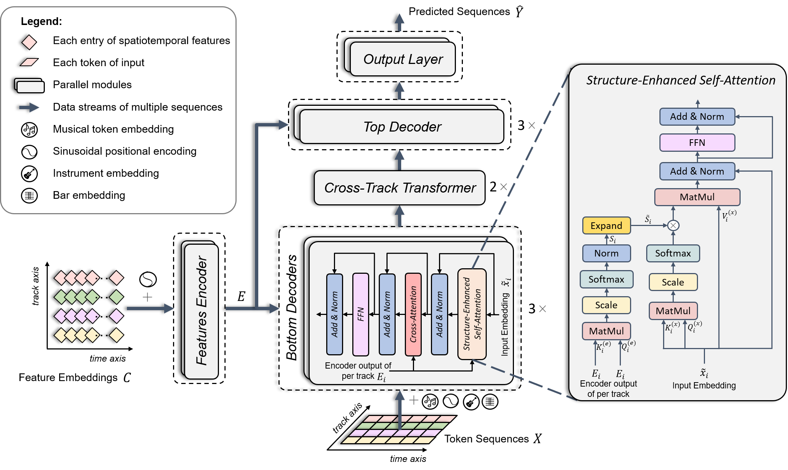

# BandControlNet: Fine-Grained Spatiotemporal Features for Steerable Popular Music Generation
[Demo](https://chinglohsiu.github.io/files/bandcontrolnet.html) | [Paper](https://arxiv.org/abs/2407.10462)
[](https://chinglohsiu.github.io/files/bandcontrolnet.html)

This is the official implementation of BandControlNet



## Description
This paper presents BandControlNet, a controllable music cover generation model that:
1. Spatiotemporal features are proposed to offer fine-grained controls on the granularity of every bar and every track for complex multitrack music.
2. We design a novel music representation called REMI_Track which tokenizes the multitrack music into multiple separated token sequences and combines BPE techniques to further compress the sequences.
3. We adapt the parallel Transformers framework to accommodate the multiple sequences under REMI_Track representation and propose structure-enhanced self-attention (SE-SA) and Cross-Track Transformer (CTT) modules to boost the structure and inter-track dependency modeling for multitrack music respectively.

## Code and File Directory
This repository is organized as follows:
```
root
  ├──custom_layers/                     structure-enhanced self-attention layer of BandControlNet, modified on pytorch-fast-transformers lib
  │    
  ├──img/                               the illustration  of BandControlNet's architecture
  │    
  ├──utils/                             utility functions for dataset, inference and model construction
  │    
  ├──VQVAE/                             scipts for vq-vae training and inference
  │   
  BandControlNet.py                     BandControlNet model
  │   
  BPE_tokenizer_v2.py                   scipt for BPE learning
  │   
  constants.py                          constant values
  │   
  Pop_dataset.py                        dataset for training and inference
  │   
  representation_multiple_v2.py         tokenization of REMI_Track    
  │   
  train_BandControlNet.py               script for training and inference    
  │ 
  └──vocab_v2.py                        vocabuluaries
```

## Dataset
We conduct experiments on a popular music subset of the LakhMIDI(LMD) dataset, which is the largest publicly available symbolic music dataset that contains multiple instruments. To ensure data quality, we perform several data cleaning and processing steps, including genre selection, melody extraction, instrument compression, and data filtering. Please refer to Appendix B of the article for details.

## Contact
If you have any questions or requests, please write to chinglohsiu[AT]gmail[DOT].com


## Citation
Please consider citing the following article if you found our work useful:
```
@article{luo2024bandcontrolnet,
         title={BandControlNet: Fine-Grained Spatiotemporal Features for Steerable Popular Music Generation}, 
         author={Luo, Jing and Yang, Xinyu and Herremans, Dorien},
         journal={arXiv preprint arXiv:2407.10462},
         year={2024}
}
```